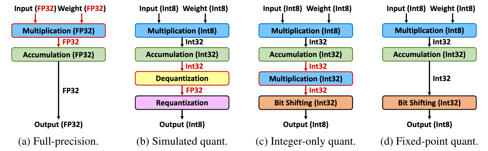

# F8Net: Fixed-Point 8-bit Only Multiplication for Network Quantization

[OpenReview](https://openreview.net/forum?id=_CfpJazzXT2)




coding coming soon ...

## Citation

If you find this work useful, please cite the following:
```
@inproceedings{jin2022fnet,
    title={F8Net: Fixed-Point 8-bit Only Multiplication for Network Quantization},
    author={Qing Jin and Jian Ren and Richard Zhuang and Sumant Hanumante and Zhengang Li and Zhiyu Chen and Yanzhi Wang and Kaiyuan Yang and Sergey Tulyakov},
    booktitle={International Conference on Learning Representations},
    year={2022},
    url={https://openreview.net/forum?id=_CfpJazzXT2}
}